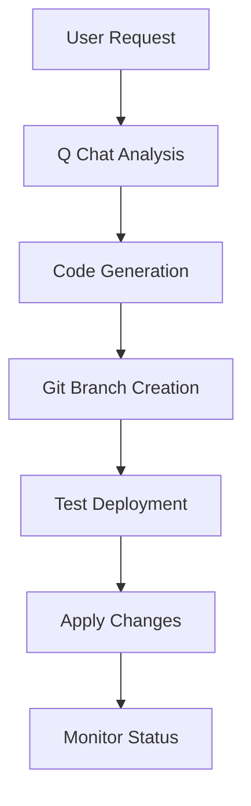

# AI-SwAutoMorph Architecture Design

## Overview

AI-SwAutoMorph is a centralized application management platform that automates the deployment, evolution, and management of containerized applications using a standardized approach. The platform leverages Docker Compose, deployment scripts, GenAI integration, and multi-server deployment capabilities to provide seamless application lifecycle management.

## Core Architecture

### 1. Modular Flask Application

```
ai-swautomorph/
├── src/                          # Core application modules
│   ├── config.py                 # Configuration & environment settings
│   ├── database.py               # Database schema & initialization with thread-safe manager
│   ├── auth.py                   # Authentication & SSO management
│   ├── app.py                    # Flask application factory
│   ├── main.py                   # Application entry point with timestamped logging
│   ├── automorph_application.py  # GenAI integration for code modification
│   ├── db_health.py              # Database health monitoring utilities
│   ├── create_gitea_repo.py      # Gitea repository management
│   ├── gitea_config.py           # Gitea configuration utilities
│   └── routes/                   # Route handlers (blueprints)
│       ├── main_routes.py        # Dashboard & main pages
│       ├── auth_routes.py        # User authentication
│       ├── sso_routes.py         # Single Sign-On functionality
│       ├── api_routes.py         # REST API endpoints with streaming support
│       └── billing_routes.py     # Billing and cost management
├── app.py                        # Legacy entry point (redirects to src/app.py)
├── deployControlPlan.sh          # Main deployment control script
├── scripts/                      # CLI tools and utilities
│   ├── cli.py                    # Command-line interface
│   ├── mcp_server.py             # Model Context Protocol server
│   ├── generate_ssl.sh           # SSL certificate generation
│   ├── fix_ssl_chain.sh          # SSL certificate chain fixing
│   ├── mount_s3fs.py             # S3 filesystem mounting
│   └── test_*.py                 # Testing utilities
├── shared/                       # Shared deployment resources
│   ├── deployApp.sh              # Universal deployment script
│   └── *_context.md              # Context templates for GenAI operations
├── templates/                    # HTML templates with multi-language support
├── static/                       # CSS, JS, and static files
├── ssl/                          # SSL certificates
├── logs/                         # Application logs with daily rotation
├── softfluid/db/                 # Database and backups
├── conf/                         # Configuration files
│   ├── deploy.ini                # Deployment configuration
│   └── app.pid                   # Application process ID
└── docker-compose.yml            # Docker containerization
```

### 2. Database Schema

```sql
-- Core entities for application management
Users: id, username, email, password_hash, first_name, last_name, suspended, created_at
Applications: id, name, description, git_url, created_at
User_Applications: id, user_id, application_id, url, http_port, https_port, created_at
Deployments: id, user_id, application_name, status, deployment_path, git_url, server_id, created_at, updated_at
Servers: id, SERVER_IP, SERVER_NAME, SERVER_CAPACITY_USER_MAX, SERVER_CAPACITY_APPLI_MAX, SERVER_STATUS, SERVER_TYPE, created_at
Auth_Tokens: id, user_id, token_hash, expires_at, created_at
Application_Costs: id, application_id, cost_per_day, created_at, updated_at
Billing_Activities: id, user_id, application_id, action, started_at, stopped_at, duration_seconds, cost_amount, created_at
Users_Logs: id, user_id, username, action, datetime
```

## Multi-Server Deployment Architecture

### 1. Server Management

The platform supports deployment across multiple servers with automatic capacity management:

```python
# Server allocation based on capacity constraints
def allocate_server(application_name):
    """
    Find available server based on:
    - SERVER_CAPACITY_USER_MAX: Maximum users per server
    - SERVER_CAPACITY_APPLI_MAX: Maximum applications per server
    - SERVER_STATUS: STAND_BY, ACTIVE, MAINTENANCE
    """
    return optimal_server_id
```

### 2. Remote Deployment

- **Local Deployment**: Direct execution on current server
- **Remote Deployment**: SSH-based execution on target servers
- **SSL Certificate Sync**: Automatic SSL certificate distribution
- **Load Balancing**: Automatic server selection based on capacity

## Application Evolution with GenAI

### 1. Q Chat Integration

The platform integrates with Amazon Q Developer for automated application evolution:

```python
# Q Chat Developer API endpoint
@api_bp.route('/qchat_developer', methods=['POST'])
def api_qchat_developer():
    """
    Process evolution requests through Q Chat with streaming response
    1. Analyze current application structure
    2. Generate code modifications using Q Chat
    3. Create new Git branch with timestamp: {user_id}-automorph-{app_name}-{timestamp}
    4. Test deployment with deployApp.sh
    5. Apply changes and redeploy automatically
    """
    return streaming_response_with_real_time_updates

# Q Chat DevOps API endpoint
@api_bp.route('/qchat_devops', methods=['POST'])
def api_qchat_devops():
    """
    Process DevOps operations through Q Chat
    - Detects bracketed actions: [START], [STOP], [RESTART], [PS], [LOGS]
    - Uses context templates from shared/*_context.md
    - Provides streaming responses for real-time feedback
    """
    return streaming_devops_response
```

### 2. Virtual DevOps Team

The platform includes context-aware virtual assistants:

- **Q Chat Developer**: Code modification and feature development with Git branch management
- **Q Chat DevOps**: Application lifecycle management (START/STOP/PS/RESTART/LOGS)
- **Context Templates**: Pre-built templates for common operations in `/shared/*_context.md`
- **Streaming Responses**: Real-time feedback using Server-Sent Events
- **Action Detection**: Automatic detection of bracketed commands like [START], [STOP]

### 3. Automated Evolution Process



### 4. Evolution Workflow

1. **Analysis Phase**
   - Q Chat analyzes existing application code
   - Identifies modification points
   - Generates implementation plan

2. **Branch Management**
   - Creates timestamped Git branch: `{user_id}-automorph-{app_name}-{timestamp}`
   - Commits changes with descriptive messages
   - Pushes to Gitea remote for tracking

3. **Code Generation**
   - Generates new features/modifications
   - Updates dependencies
   - Maintains application structure

4. **Deployment Testing**
   - Uses same `deployApp.sh` script
   - Validates deployment success
   - Performs health checks

## Database Improvements

### 1. Thread-Safe Connection Management

```python
class DatabaseManager:
    """Thread-safe database manager with connection pooling"""
    
    def __init__(self):
        self._local = threading.local()
    
    @contextmanager
    def get_db_connection(self):
        """Context manager for database connections"""
        conn = self._get_connection()
        try:
            yield conn
        except Exception as e:
            conn.rollback()
            raise
```

### 2. WAL Mode and Retry Logic

- **WAL Mode**: Enables better concurrent read/write operations
- **Busy Timeout**: 30-second timeout for locked database operations
- **Retry Logic**: Automatic retry with exponential backoff on lock errors
- **Health Monitoring**: Database performance and statistics tracking

## Containerization Strategy

### Docker Compose Architecture

The platform uses a multi-service Docker Compose setup for scalability and isolation:

```yaml
# docker-compose.yml structure
services:
  ai-swautomorph:         # Main Flask application
    build: .
    ports: ["${HTTP_PORT:-6000}:80"]
    volumes: 
      - app_data:/app/data
      - ~/.ssh:/home/ubuntu/.ssh:ro
      - /var/run/docker.sock:/var/run/docker.sock
    environment:
      - FLASK_ENV=production
      - SECRET_KEY=${SECRET_KEY}
    
  nginx:                  # Reverse proxy & SSL termination
    image: nginx:alpine
    ports: ["${HTTPS_PORT:-6001}:443"]
    volumes: 
      - ./conf/nginx.conf:/etc/nginx/nginx.conf:ro
      - ./ssl:/etc/nginx/ssl:ro
    
  gitea:                  # Git repository server
    image: gitea/gitea:1.21.3
    ports: ["3000:3000"]
    volumes:
      - gitea_data:/data
      - gitea_repos:/home/ubuntu/admin/data/gitea-repositories
    environment:
      - GITEA__database__DB_TYPE=sqlite3
      - GITEA__server__DOMAIN=localhost
      - GITEA__server__ROOT_URL=http://localhost:3000/
```

## Universal Deployment System

### 1. Standardized Deployment Process

All applications follow the same deployment pattern:

```bash
# Universal workflow for any application
1. Server Allocation → Automatic selection based on capacity constraints
2. Clone repository → User-specific directory with SSL certificate sync
3. Execute deployApp.sh → Start/stop/status/restart/logs operations
4. Monitor status → Real-time health checks & streaming logs
5. Billing tracking → Automatic cost calculation and recording
```

### 2. Deploy Configuration (deploy.ini)

Each application uses configuration from `conf/deploy.ini`:

```ini
NAME_OF_APPLICATION=ai-swautomorph
APPLICATION_IDENTITY_NUMBER=0
RANGE_START=8100
RANGE_RESERVED=100
RANGE_START_CONTROLPLAN=80
RANGE_RESERVED_CONTROLPLAN=0
DOMAIN=www.swautomorph.com
EMAIL=admin@swautomorph.com
GITEA_VERSION=1.21.3
MODSECURITY_CONF_DIR=/etc/nginx/modsec
```

### 3. Port Allocation System

Automatic port calculation based on user and application IDs:

```python
def calculate_app_ports(user_id, app_id):
    """Calculate HTTP and HTTPS ports using deployControlPlan.sh logic"""
    # Load configuration from deploy.ini
    RANGE_START = int(config.get('RANGE_START', 8100))
    RANGE_RESERVED = int(config.get('RANGE_RESERVED', 100))
    
    PORT_RANGE_BEGIN = RANGE_START + user_id * RANGE_RESERVED
    HTTP_PORT = PORT_RANGE_BEGIN + app_id * 2
    HTTPS_PORT = HTTP_PORT + 1
    return HTTP_PORT, HTTPS_PORT
```

## Deployment Isolation

### User-Specific Deployments

```
/home/ubuntu/deployments/
├── user1/
│   ├── ai-haccp/
│   │   ├── deployApp.sh
│   │   └── src/
│   └── ai-foodflow/
│       ├── deployApp.sh
│       └── src/
└── user2/
    └── custom-app/
        ├── deployApp.sh
        └── src/
```

### Benefits

- **Isolation**: Each user's deployments are separate
- **Security**: No cross-user access to deployments
- **Customization**: Users can modify their applications independently
- **Scalability**: Easy to manage multiple users and applications

## API Integration

### Deployment API Endpoints

```python
# REST API for deployment management
@api_bp.route('/deployments', methods=['GET', 'POST'])
def api_deployments():
    """Handle clone, start, stop, restart, ps, logs actions with streaming support"""
    
@api_bp.route('/deployments/<int:deployment_id>/logs')
def api_deployment_logs(deployment_id):
    """Get deployment logs for specific deployment"""
    
@api_bp.route('/qchat_developer', methods=['POST'])
def api_qchat_developer():
    """Process Q Chat Developer requests for code modification with streaming"""

@api_bp.route('/qchat_devops', methods=['POST'])
def api_qchat_devops():
    """Process Q Chat DevOps operations with context templates and streaming"""

@api_bp.route('/server/allocate', methods=['POST'])
def api_server_allocate():
    """Allocate optimal server based on capacity constraints"""

@api_bp.route('/servers', methods=['GET', 'POST'])
def api_servers():
    """Server management for admin users"""
```

### Streaming Support

- **Real-time Logs**: Server-sent events for deployment logs
- **Q Chat Streaming**: Live response streaming from GenAI
- **Progress Updates**: Real-time deployment status updates

## Billing and Cost Management

### 1. Cost Tracking

```python
# Automatic billing for application usage
def record_billing_activity(user_id, app_name, action):
    """Record start/stop actions for billing calculation"""
    
# Cost calculation based on usage duration
Application_Costs: cost_per_day (default: 1.0)
Billing_Activities: duration_seconds, cost_amount
```

### 2. Usage Monitoring

- **Start/Stop Tracking**: Automatic billing event recording
- **Duration Calculation**: Precise usage time measurement
- **Cost Reports**: Per-user and per-application cost analysis

## Security Architecture

### 1. Multi-Layer Security

- **SSL/TLS**: HTTPS encryption with automatic certificate distribution
- **ModSecurity WAF**: OWASP CRS rules for web application firewall protection
- **Authentication**: User-based access control with suspension capability
- **SSO Tokens**: Secure token-based application access with automatic cleanup
- **Container Isolation**: Docker container security with volume mounting
- **Network Segmentation**: Internal service communication with firewall rules
- **Gitea Integration**: Secure Git repository management with user isolation

### 2. Token Management

```python
# SSO token lifecycle with automatic cleanup
class SSOTokenManager:
    def generate_token(self, user_id):
        """Generate secure token with expiration"""
        
    def validate_token(self, token):
        """Validate token and return user info"""
        
    def revoke_token(self, user_id):
        """Revoke existing tokens on new login"""
```

## Internationalization

### Multi-Language Support

The platform supports multiple languages through configuration:

```python
# Language translations in config.py
TRANSLATIONS = {
    'en': {'login': 'Login', 'register': 'Register', ...},
    'fr': {'login': 'Connexion', 'register': 'Inscription', ...}
}
```

- **Dynamic Language Switching**: Session-based language selection
- **Template Integration**: Automatic translation in HTML templates
- **API Responses**: Localized error messages and responses

## Monitoring and Logging

### 1. Application Monitoring

```python
# Health check endpoints for all applications
@api_bp.route('/auth/status')
def auth_status():
    return jsonify({
        'authenticated': 'user_id' in session,
        'sso_token': session.get('sso_token', '')
    })

# Database health monitoring (admin only)
@api_bp.route('/health/database')
def database_health():
    health_status = check_database_health()
    db_stats = get_database_stats()
    return jsonify({'health': health_status, 'statistics': db_stats})
```

### 2. Deployment Monitoring

- **Status Tracking**: Real-time deployment status with database persistence
- **Log Aggregation**: Daily log rotation with centralized storage in logs/ directory
- **Streaming Logs**: Real-time log streaming using Server-Sent Events
- **Error Reporting**: Automatic error detection with detailed stack traces
- **Performance Metrics**: Database health monitoring with WAL mode statistics
- **Backup Monitoring**: Automated hourly database backups with S3 sync
- **Service Status**: Comprehensive service monitoring via deployControlPlan.sh ps

## Current Advanced Features

### 1. Implemented GenAI Integration

- **Q Chat Developer**: Real-time code modification with Git branch management
- **Q Chat DevOps**: Context-aware deployment operations with streaming responses
- **Automated Branch Creation**: Timestamped branches for code evolution tracking
- **Context Templates**: Pre-built operation templates in shared/ directory

### 2. Current Deployment Features

- **Multi-Server Support**: Automatic server allocation based on capacity
- **Real-time Streaming**: Live deployment logs and status updates
- **SSL Certificate Sync**: Automatic certificate distribution to all deployments
- **Billing Integration**: Automatic cost tracking and usage monitoring
- **Database Backups**: Automated hourly backups with S3 synchronization
- **Health Monitoring**: Comprehensive database and application health checks

## Conclusion

The AI-SwAutoMorph architecture provides a robust, scalable, and automated platform for application management with advanced GenAI integration. By combining standardized deployment processes through deployControlPlan.sh, multi-server capacity management, real-time streaming capabilities, and Q Chat integration, the platform enables rapid application development and evolution while maintaining security and isolation.

Key architectural strengths include:
- **Thread-safe database operations** with WAL mode and automatic retry logic
- **Multi-server deployment** with automatic capacity-based allocation
- **Real-time streaming** for deployment logs and AI assistant responses
- **Comprehensive security** with ModSecurity WAF and SSL certificate management
- **Automated billing** with precise usage tracking and cost calculation
- **GenAI integration** for code evolution and DevOps operations

The modular Flask blueprint architecture ensures maintainability and extensibility, while the automation features reduce manual intervention and improve reliability. This architecture serves as a foundation for building and managing modern containerized applications with AI-assisted evolution capabilities and enterprise-grade monitoring and security features.