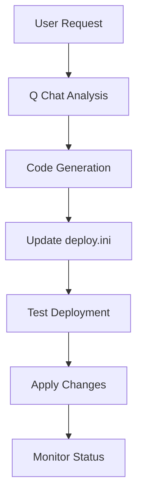

# AI-SwAutoMorph Architecture Design

## Overview

AI-SwAutoMorph is a centralized application management platform that automates the deployment, evolution, and management of containerized applications using a standardized approach. The platform leverages Docker Compose, deployment scripts, and GenAI integration to provide seamless application lifecycle management.

## Core Architecture

### 1. Modular Flask Application

```
ai-swautomorph/
├── src/                          # Core application modules
│   ├── config.py                 # Configuration & environment settings
│   ├── database.py               # Database schema & initialization
│   ├── auth.py                   # Authentication & SSO management
│   ├── app.py                    # Flask application factory
│   └── routes/                   # Route handlers (blueprints)
│       ├── main_routes.py        # Dashboard & main pages
│       ├── auth_routes.py        # User authentication
│       ├── sso_routes.py         # Single Sign-On functionality
│       └── api_routes.py         # REST API endpoints
├── app.py                        # Application entry point
├── cli.py                        # Command-line interface
├── mcp_server.py                 # Model Context Protocol server
└── deployApp.sh                     # Universal deployment script
```

### 2. Database Schema

```sql
-- Core entities for application management
Users: id, username, email, password_hash, created_at
Applications: id, name, url, description, git_url, created_at
Deployments: id, user_id, application_name, status, deployment_path, git_url
Auth_Tokens: id, user_id, token_hash, expires_at, created_at
```

## Containerization Strategy

### Docker Compose Architecture

The platform uses a multi-service Docker Compose setup for scalability and isolation:

```yaml
# docker-compose.yml structure
services:
  app:                    # Main Flask application
    build: .
    ports: ["5000:5000"]
    volumes: ["/deployments:/deployments"]
    
  nginx:                  # Reverse proxy & SSL termination
    image: nginx:alpine
    ports: ["80:80", "443:443"]
    volumes: ["./conf/nginx.conf:/etc/nginx/nginx.conf"]
    
  db:                     # Database (optional - can use SQLite)
    image: postgres:13
    environment: [POSTGRES_DB, POSTGRES_USER, POSTGRES_PASSWORD]
```

### Benefits of Docker Compose

- **Service Isolation**: Each component runs in its own container
- **Environment Consistency**: Same setup across development/production
- **Easy Scaling**: Services can be scaled independently
- **Network Management**: Internal service communication
- **Volume Management**: Persistent data storage

## Universal Deployment System

### 1. Standardized Deployment Process

All applications follow the same deployment pattern:

```bash
# Universal workflow for any application
1. Clone repository → User-specific directory
2. Read deploy.ini → Application configuration
3. Execute deployApp.sh → Start/stop/status operations
4. Monitor status → Health checks & logging
```

### 2. Deploy Configuration (deploy.ini)

Each application requires only a `deploy.ini` file for customization:

```ini
[application]
name = AI-HACCP
port = 3000
git_url = https://github.com/user/ai-haccp.git
docker_compose_file = docker-compose.yml
health_check_url = http://localhost:3000/health

[environment]
NODE_ENV = production
DATABASE_URL = sqlite:///data/app.db
API_KEY = ${API_KEY}

[deployment]
pre_start_commands = npm install, npm run build
post_start_commands = npm run migrate
restart_policy = unless-stopped
```

### 3. Universal Deploy Script (deployApp.sh)

The same `deployApp.sh` script works for all applications:

```bash
#!/bin/bash
# Universal deployment script - works for any application

ACTION=$1
CONFIG_FILE="deploy.ini"

# Read configuration
source_config() {
    # Parse deploy.ini and set environment variables
    eval $(python3 -c "
import configparser
config = configparser.ConfigParser()
config.read('$CONFIG_FILE')
for section in config.sections():
    for key, value in config[section].items():
        print(f'export {key.upper()}={value}')
    ")
}

case $ACTION in
    "start")
        source_config
        docker-compose -f $DOCKER_COMPOSE_FILE up -d
        ;;
    "stop")
        docker-compose -f $DOCKER_COMPOSE_FILE down
        ;;
    "status")
        docker-compose -f $DOCKER_COMPOSE_FILE ps
        ;;
    "logs")
        docker-compose -f $DOCKER_COMPOSE_FILE logs -f
        ;;
esac
```

## Application Evolution with GenAI

### 1. Q Chat Integration

The platform integrates with Amazon Q Developer for automated application evolution:

```python
# MCP Server for GenAI integration
class MCPServer:
    def handle_evolution_request(self, app_name, requirements):
        """
        Process evolution requests through Q Chat
        1. Analyze current application structure
        2. Generate code modifications
        3. Update deploy.ini if needed
        4. Test deployment
        5. Apply changes
        """
        return self.apply_ai_changes(app_name, requirements)
```

### 2. Automated Evolution Process



### 3. Evolution Workflow

1. **Analysis Phase**
   - Q Chat analyzes existing application code
   - Identifies modification points
   - Generates implementation plan

2. **Configuration Update**
   - Modifies `deploy.ini` if needed (ports, environment variables)
   - Updates Docker Compose configuration
   - Adjusts deployment parameters

3. **Code Generation**
   - Generates new features/modifications
   - Updates dependencies
   - Maintains application structure

4. **Deployment Testing**
   - Uses same `deployApp.sh` script
   - Validates deployment success
   - Performs health checks

## Deployment Isolation

### User-Specific Deployments

```
/home/ubuntu/deployments/
├── user1/
│   ├── ai-haccp/
│   │   ├── deploy.ini
│   │   ├── docker-compose.yml
│   │   └── src/
│   └── ai-foodflow/
│       ├── deploy.ini
│       ├── docker-compose.yml
│       └── src/
└── user2/
    └── custom-app/
        ├── deploy.ini
        ├── docker-compose.yml
        └── src/
```

### Benefits

- **Isolation**: Each user's deployments are separate
- **Security**: No cross-user access to deployments
- **Customization**: Users can modify their applications independently
- **Scalability**: Easy to manage multiple users and applications

## API Integration

### Deployment API Endpoints

```python
# REST API for deployment management
@app.route('/api/deploy/<app_name>', methods=['POST'])
def deploy_application(app_name):
    """Start application deployment"""
    
@app.route('/api/deploy/<app_name>/status', methods=['GET'])
def get_deployment_status(app_name):
    """Get deployment status and logs"""
    
@app.route('/api/deploy/<app_name>', methods=['DELETE'])
def stop_application(app_name):
    """Stop application deployment"""
```

### SSO Integration

```python
# Single Sign-On for deployed applications
@app.route('/sso/validate', methods=['POST'])
def validate_sso_token():
    """Validate SSO token for application access"""
    
# Automatic token passing to deployed applications
# Example: http://ai-haccp.swautomorph.com:3000?sso_token=abc123
```

## Security Architecture

### 1. Multi-Layer Security

- **SSL/TLS**: HTTPS encryption for all communications
- **Authentication**: User-based access control
- **SSO Tokens**: Secure token-based application access
- **Container Isolation**: Docker container security
- **Network Segmentation**: Internal service communication

### 2. Token Management

```python
# SSO token lifecycle
class SSOTokenManager:
    def generate_token(self, user_id):
        """Generate secure token with expiration"""
        
    def validate_token(self, token):
        """Validate token and return user info"""
        
    def revoke_token(self, user_id):
        """Revoke existing tokens on new login"""
```

## Scalability Design

### 1. Horizontal Scaling

- **Load Balancing**: Nginx reverse proxy
- **Service Scaling**: Docker Compose service replicas
- **Database Scaling**: Connection pooling and read replicas

### 2. Resource Management

- **Container Limits**: CPU and memory constraints
- **Storage Management**: Volume mounting and cleanup
- **Network Optimization**: Internal service communication

## Monitoring and Logging

### 1. Application Monitoring

```python
# Health check endpoints for all applications
@app.route('/health')
def health_check():
    return {"status": "healthy", "timestamp": datetime.now()}
```

### 2. Deployment Monitoring

- **Status Tracking**: Real-time deployment status
- **Log Aggregation**: Centralized logging from all containers
- **Error Reporting**: Automatic error detection and reporting

## Future Enhancements

### 1. Advanced GenAI Integration

- **Automated Testing**: AI-generated test cases
- **Performance Optimization**: AI-driven performance improvements
- **Security Scanning**: Automated vulnerability detection

### 2. Enhanced Deployment Features

- **Blue-Green Deployments**: Zero-downtime deployments
- **Rollback Capabilities**: Automatic rollback on failure
- **Multi-Environment Support**: Development, staging, production

## Conclusion

The AI-SwAutoMorph architecture provides a robust, scalable, and automated platform for application management. By standardizing the deployment process through `deploy.ini` configuration and universal `deployApp.sh` scripts, combined with Docker Compose containerization and GenAI integration, the platform enables rapid application development and evolution while maintaining security and isolation.

The modular design ensures maintainability and extensibility, while the automation features reduce manual intervention and improve reliability. This architecture serves as a foundation for building and managing modern containerized applications with AI-assisted evolution capabilities.