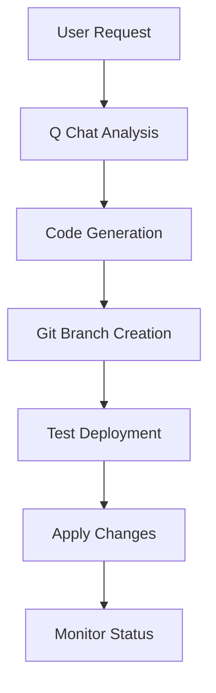

# AI-SwAutoMorph Architecture Design

## Overview

AI-SwAutoMorph is a centralized application management platform that automates the deployment, evolution, and management of containerized applications using a standardized approach. The platform leverages Docker Compose, deployment scripts, GenAI integration, and multi-server deployment capabilities to provide seamless application lifecycle management.

## Core Architecture

### 1. Modular Flask Application

```
ai-swautomorph/
├── src/                          # Core application modules
│   ├── config.py                 # Configuration & environment settings
│   ├── database.py               # Database schema & initialization with thread-safe manager
│   ├── auth.py                   # Authentication & SSO management
│   ├── app.py                    # Flask application factory
│   ├── main.py                   # Application entry point with timestamped logging
│   ├── automorph_application.py  # GenAI integration for code modification
│   ├── db_health.py              # Database health monitoring utilities
│   └── routes/                   # Route handlers (blueprints)
│       ├── main_routes.py        # Dashboard & main pages
│       ├── auth_routes.py        # User authentication
│       ├── sso_routes.py         # Single Sign-On functionality
│       ├── api_routes.py         # REST API endpoints with streaming support
│       └── billing_routes.py     # Billing and cost management
├── app.py                        # Legacy entry point (redirects to src/main.py)
├── scripts/
│   ├── cli.py                    # Command-line interface
│   └── mcp_server.py             # Model Context Protocol server
├── shared/                       # Shared deployment resources
│   ├── deployApp.sh              # Universal deployment script
│   └── *_context.md              # Context templates for GenAI operations
└── templates/                    # HTML templates with multi-language support
```

### 2. Database Schema

```sql
-- Core entities for application management
Users: id, username, email, password_hash, first_name, last_name, suspended, created_at
Applications: id, name, description, git_url, created_at
User_Applications: id, user_id, application_id, url, created_at
Deployments: id, user_id, application_name, status, deployment_path, git_url, server_id, created_at, updated_at
Servers: id, SERVER_IP, SERVER_NAME, SERVER_CAPACITY_USER_MAX, SERVER_CAPACITY_APPLI_MAX, SERVER_STATUS, SERVER_TYPE, created_at
Auth_Tokens: id, user_id, token_hash, expires_at, created_at
Application_Costs: id, application_id, cost_per_day, created_at, updated_at
Billing_Activities: id, user_id, application_id, action, started_at, stopped_at, duration_seconds, cost_amount, created_at
Users_Logs: id, user_id, username, action, datetime
```

## Multi-Server Deployment Architecture

### 1. Server Management

The platform supports deployment across multiple servers with automatic capacity management:

```python
# Server allocation based on capacity constraints
def allocate_server(application_name):
    """
    Find available server based on:
    - SERVER_CAPACITY_USER_MAX: Maximum users per server
    - SERVER_CAPACITY_APPLI_MAX: Maximum applications per server
    - SERVER_STATUS: STAND_BY, ACTIVE, MAINTENANCE
    """
    return optimal_server_id
```

### 2. Remote Deployment

- **Local Deployment**: Direct execution on current server
- **Remote Deployment**: SSH-based execution on target servers
- **SSL Certificate Sync**: Automatic SSL certificate distribution
- **Load Balancing**: Automatic server selection based on capacity

## Application Evolution with GenAI

### 1. Q Chat Integration

The platform integrates with Amazon Q Developer for automated application evolution:

```python
# Automorph application for GenAI integration
def process_qchat_developer(user_request, auto_approve=True, app_name='', app_folder='', git_url='', user_id='0', user_name='anonymous'):
    """
    Process evolution requests through Q Chat
    1. Analyze current application structure
    2. Generate code modifications
    3. Create new Git branch with timestamp
    4. Test deployment
    5. Apply changes and redeploy
    """
    return result_with_branch_name_and_execution_details
```

### 2. Virtual DevOps Team

The platform includes context-aware virtual assistants:

- **Virtual Developer**: Code modification and feature development
- **Virtual DevOps Team**: Application lifecycle management (START/STOP/PS/RESTART/LOGS)
- **Context Templates**: Pre-built templates for common operations in `/shared/*_context.md`

### 3. Automated Evolution Process



### 4. Evolution Workflow

1. **Analysis Phase**
   - Q Chat analyzes existing application code
   - Identifies modification points
   - Generates implementation plan

2. **Branch Management**
   - Creates timestamped Git branch: `{user_id}-automorph-{app_name}-{timestamp}`
   - Commits changes with descriptive messages
   - Pushes to Gitea remote for tracking

3. **Code Generation**
   - Generates new features/modifications
   - Updates dependencies
   - Maintains application structure

4. **Deployment Testing**
   - Uses same `deployApp.sh` script
   - Validates deployment success
   - Performs health checks

## Database Improvements

### 1. Thread-Safe Connection Management

```python
class DatabaseManager:
    """Thread-safe database manager with connection pooling"""
    
    def __init__(self):
        self._local = threading.local()
    
    @contextmanager
    def get_db_connection(self):
        """Context manager for database connections"""
        conn = self._get_connection()
        try:
            yield conn
        except Exception as e:
            conn.rollback()
            raise
```

### 2. WAL Mode and Retry Logic

- **WAL Mode**: Enables better concurrent read/write operations
- **Busy Timeout**: 30-second timeout for locked database operations
- **Retry Logic**: Automatic retry with exponential backoff on lock errors
- **Health Monitoring**: Database performance and statistics tracking

## Containerization Strategy

### Docker Compose Architecture

The platform uses a multi-service Docker Compose setup for scalability and isolation:

```yaml
# docker-compose.yml structure
services:
  app:                    # Main Flask application
    build: .
    ports: ["5000:5000"]
    volumes: ["/deployments:/deployments"]
    
  nginx:                  # Reverse proxy & SSL termination
    image: nginx:alpine
    ports: ["80:80", "443:443"]
    volumes: ["./conf/nginx.conf:/etc/nginx/nginx.conf"]
```

## Universal Deployment System

### 1. Standardized Deployment Process

All applications follow the same deployment pattern:

```bash
# Universal workflow for any application
1. Clone repository → User-specific directory
2. Allocate server → Based on capacity constraints
3. Execute deployApp.sh → Start/stop/status operations
4. Monitor status → Health checks & logging
```

### 2. Deploy Configuration (deploy.ini)

Each application uses configuration from `conf/deploy.ini`:

```ini
NAME_OF_APPLICATION=ai-swautomorph
APPLICATION_IDENTITY_NUMBER=0
RANGE_START=8100
RANGE_RESERVED=100
RANGE_START_CONTROLPLAN=8000
RANGE_RESERVED_CONTROLPLAN=100
```

### 3. Port Allocation System

Automatic port calculation based on user and application IDs:

```python
def calculate_app_ports(user_id, app_id):
    """Calculate HTTP and HTTPS ports using deployControlPlan.sh logic"""
    PORT_RANGE_BEGIN = RANGE_START + user_id * RANGE_RESERVED
    HTTP_PORT = PORT_RANGE_BEGIN + app_id * 2
    HTTPS_PORT = HTTP_PORT + 1
    return HTTP_PORT, HTTPS_PORT
```

## Deployment Isolation

### User-Specific Deployments

```
/home/ubuntu/deployments/
├── user1/
│   ├── ai-haccp/
│   │   ├── deployApp.sh
│   │   └── src/
│   └── ai-foodflow/
│       ├── deployApp.sh
│       └── src/
└── user2/
    └── custom-app/
        ├── deployApp.sh
        └── src/
```

### Benefits

- **Isolation**: Each user's deployments are separate
- **Security**: No cross-user access to deployments
- **Customization**: Users can modify their applications independently
- **Scalability**: Easy to manage multiple users and applications

## API Integration

### Deployment API Endpoints

```python
# REST API for deployment management
@app.route('/api/deployments', methods=['POST'])
def api_deployments():
    """Handle clone, start, stop, restart, ps, logs actions"""
    
@app.route('/api/deployments/<int:deployment_id>/logs', methods=['GET'])
def api_deployment_logs(deployment_id):
    """Get deployment logs"""
    
@app.route('/api/qchat', methods=['POST'])
def api_qchat():
    """Process Q Chat requests for code modification"""

@app.route('/api/qchat_devops', methods=['POST'])
def api_qchat_devops():
    """Process Virtual Advisor questions with streaming response"""
```

### Streaming Support

- **Real-time Logs**: Server-sent events for deployment logs
- **Q Chat Streaming**: Live response streaming from GenAI
- **Progress Updates**: Real-time deployment status updates

## Billing and Cost Management

### 1. Cost Tracking

```python
# Automatic billing for application usage
def record_billing_activity(user_id, app_name, action):
    """Record start/stop actions for billing calculation"""
    
# Cost calculation based on usage duration
Application_Costs: cost_per_day (default: 1.0)
Billing_Activities: duration_seconds, cost_amount
```

### 2. Usage Monitoring

- **Start/Stop Tracking**: Automatic billing event recording
- **Duration Calculation**: Precise usage time measurement
- **Cost Reports**: Per-user and per-application cost analysis

## Security Architecture

### 1. Multi-Layer Security

- **SSL/TLS**: HTTPS encryption for all communications
- **Authentication**: User-based access control with suspension capability
- **SSO Tokens**: Secure token-based application access
- **Container Isolation**: Docker container security
- **Network Segmentation**: Internal service communication

### 2. Token Management

```python
# SSO token lifecycle with automatic cleanup
class SSOTokenManager:
    def generate_token(self, user_id):
        """Generate secure token with expiration"""
        
    def validate_token(self, token):
        """Validate token and return user info"""
        
    def revoke_token(self, user_id):
        """Revoke existing tokens on new login"""
```

## Internationalization

### Multi-Language Support

The platform supports multiple languages through configuration:

```python
# Language translations in config.py
TRANSLATIONS = {
    'en': {'login': 'Login', 'register': 'Register', ...},
    'fr': {'login': 'Connexion', 'register': 'Inscription', ...}
}
```

- **Dynamic Language Switching**: Session-based language selection
- **Template Integration**: Automatic translation in HTML templates
- **API Responses**: Localized error messages and responses

## Monitoring and Logging

### 1. Application Monitoring

```python
# Health check endpoints for all applications
@app.route('/health')
def health_check():
    return {"status": "healthy", "timestamp": datetime.now()}

# Database health monitoring
@app.route('/api/health/database')
def database_health():
    return health_status_and_statistics
```

### 2. Deployment Monitoring

- **Status Tracking**: Real-time deployment status
- **Log Aggregation**: Centralized logging from all containers
- **Error Reporting**: Automatic error detection and reporting
- **Performance Metrics**: Database and application performance tracking

## Future Enhancements

### 1. Advanced GenAI Integration

- **Automated Testing**: AI-generated test cases
- **Performance Optimization**: AI-driven performance improvements
- **Security Scanning**: Automated vulnerability detection

### 2. Enhanced Deployment Features

- **Blue-Green Deployments**: Zero-downtime deployments
- **Rollback Capabilities**: Automatic rollback on failure
- **Multi-Environment Support**: Development, staging, production

## Conclusion

The AI-SwAutoMorph architecture provides a robust, scalable, and automated platform for application management. By standardizing the deployment process through configuration-driven deployment, combined with Docker Compose containerization, multi-server support, and GenAI integration, the platform enables rapid application development and evolution while maintaining security and isolation.

The modular design ensures maintainability and extensibility, while the automation features reduce manual intervention and improve reliability. This architecture serves as a foundation for building and managing modern containerized applications with AI-assisted evolution capabilities.