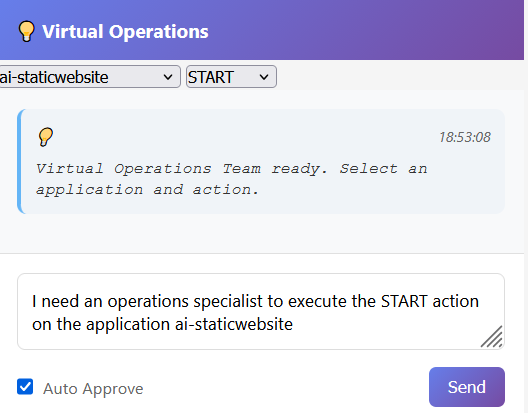

# 🤖 AI-SwAutoMorph Agent Guide

## Table of Contents
- [Overview for AI Agents](#overview-for-ai-agents)
- [AI Agent Types](#ai-agent-types)
- [Q Chat Developer Agent](#q-chat-developer-agent)
- [Q Chat Operations Agent](#q-chat-operations-agent)
- [Agent Workflows](#agent-workflows)

- [Troubleshooting](#troubleshooting)

## Overview for AI Agents

AI-SwAutoMorph is specifically designed to enable GenAI agents to autonomously deploy, manage, and modify web applications without human intervention. The platform provides two specialized AI agents for complete application lifecycle management.

**Agent-Centric Design:** Built for autonomous AI agents to handle development, deployment, and operations tasks through intelligent automation.

## AI Agent Types

### 🔧 Q Chat Developer Agent
**Purpose:** Code modification, feature development, and application enhancement

- Modifies source code based on natural language requests
- Adds new features and API endpoints
- Refactors and optimizes existing code
- Handles bug fixes and code improvements

### 🚀 Q Chat Operations Agent
**Purpose:** Deployment operations, infrastructure management, and application lifecycle

- Handles deployment commands (START, STOP, RESTART)
- Manages application lifecycle and monitoring
- Performs infrastructure operations
- Executes deployment scripts and configurations



## Q Chat Developer Agent

### Agent Capabilities
- **Code Analysis:** Understands existing codebase structure
- **Feature Development:** Adds new functionality based on requirements
- **API Creation:** Generates new REST endpoints and handlers
- **Code Refactoring:** Improves code quality and performance
- **Bug Resolution:** Identifies and fixes code issues


## Q Chat Operations Agent

### Agent Capabilities
- **Deployment Management:** Handles START, STOP, RESTART operations
- **Infrastructure Operations:** Manages servers and resources
- **Monitoring:** Checks application status and logs
- **Scaling:** Manages application capacity and performance
- **Troubleshooting:** Diagnoses and resolves deployment issues


## Agent Workflows

### 1. Application Setup
- Register agent user account
- Add application with Git repository
- Clone application to deployment directory

### 2. Development Phase (Developer Agent)
- Analyze existing codebase
- Implement new features or fixes
- Modify configuration files
- Update dependencies

### 3. Deployment Phase (Operations Agent)
- Start application services
- Monitor deployment status
- Check application logs
- Manage application lifecycle

## Troubleshooting

### Authentication Failures
- Verify session cookies are included in requests
- Check if agent account has appropriate permissions
- Ensure SSO token is valid

### Developer Agent Issues
- Verify application folder path exists
- Check if application has proper file permissions
- Ensure Git repository is accessible

### Operations Agent Issues
- Check if deployment scripts are executable
- Verify Docker services are running
- Ensure server has sufficient resources

### Debug Commands
```bash
# Check agent authentication status
curl https://www.swautomorph.com/api/auth/status

# Verify application exists
curl https://www.swautomorph.com/api/applications

# Check server capacity
curl https://www.swautomorph.com/api/servers

# Test agent communication
curl -X POST /api/qchat_developer -d '{"message":"test connection","application_name":"test"}'
```